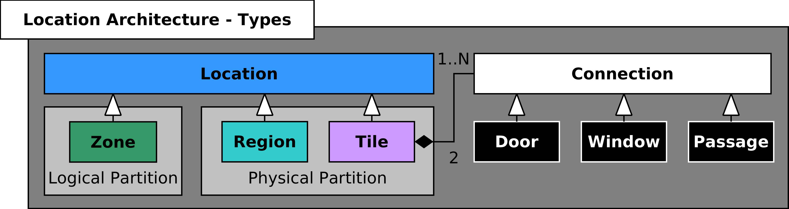
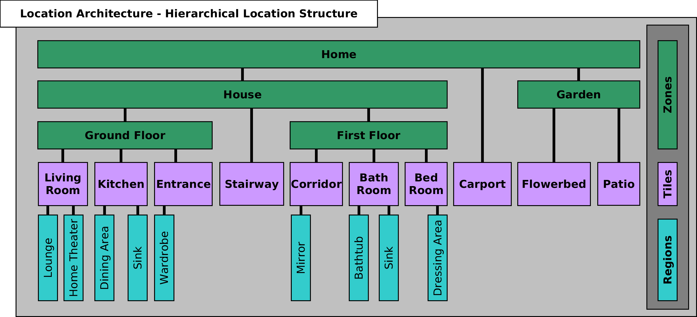
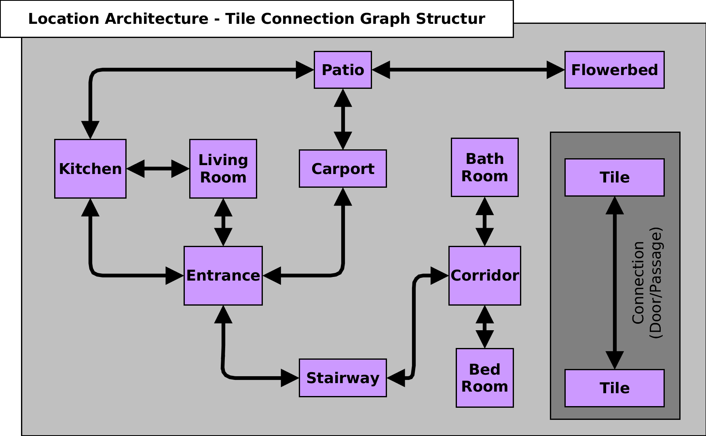

# Software Architecture

## Domotic Abstraction Layer (DAL)


### Unit Layer


### Service Layer

## Location Architecture







# Software Components


## Core Framework

### BCO DAL
[](https://travis-ci.org/openbase/bco.dal?branch=master)
[](https://travis-ci.org/openbase/bco.dal?branch=latest-stable)

#### Maven Artifact
```xml
<dependency>
    <groupId>org.openbase.bco</groupId>
    <artifactId>dal.remote</artifactId>
    <version>[1.3,1.4-SNAPSHOT)</version>
</dependency>
```

Repository: [https://github.com/openbase/bco.dal.git](https://github.com/openbase/bco.dal.git)

### BCO Registry
[](https://travis-ci.org/openbase/bco.registry?branch=master)
[](https://travis-ci.org/openbase/bco.registry?branch=latest-stable)

#### Maven Artifact
```xml
<dependency>
    <groupId>org.openbase.bco</groupId>
    <artifactId>registry</artifactId>
    <version>[1.3,1.4-SNAPSHOT)</version>
</dependency>
```

Repository: [https://github.com/openbase/bco.registry.git](https://github.com/openbase/bco.registry.git)

### BCO Manager
[](https://travis-ci.org/openbase/bco.manager?branch=master)
[](https://travis-ci.org/openbase/bco.manager?branch=latest-stable)

#### Maven Artifact
```xml
<dependency>
    <groupId>org.openbase.bco</groupId>
    <artifactId>manager</artifactId>
    <version>[1.3,1.4-SNAPSHOT)</version>
</dependency>
```

Repository:[https://github.com/openbase/bco.manager.git](https://github.com/openbase/bco.manager.git)


## Developer Tools
```
bco-registry-editor
```
```
bco-registry-printer
```
```
bco-scene-editor
```
```
bco-visual-remote
```

## User Interfaces

### Desktop (JavaFX)
```
bcozy
```
### Android
bcomfy

# Used Libaries

## Libraries from openBase

* JPS https://github.com/openbase/jps
    * A command-line argument parser and application property management framework.
* JUL https://github.com/openbase/jul
    * A java utility library.

## Libraries from Citec (University of Bielefeld)

* RSB http://docs.cor-lab.de//rsb-manual/0.15/html/examples.html
    * The middleware used for platform independent network communication.
* RST http://docs.cor-lab.de//rst-manual/0.15/html/data-types.html
    * The data type library based on google protocol-buffers.
        * https://developers.google.com/protocol-buffers/

# Development Installation Guide - Ubuntu / Debian

## Reqirements

* Java JDK 8 (Oracle JDK recommented)
    * Debian: http://www.webupd8.org/2014/03/how-to-install-oracle-java-8-in-debian.html
    * Ubuntu: https://wiki.ubuntuusers.de/Java/Installation/Oracle_Java/Java_8/
* Maven
    * ```sudo apt-get install maven```
* Git
    * ```sudo apt-get install git```

##  Environment Setup

Define where to install the bco distribution via the prefix variable.
```
echo 'export prefix="/usr/local/bco"' >> ~/.bashrc
```
Add the ```bin``` folder to your global ```$PATH``` variable to support direct binary execution.
```
echo 'export PATH="$PATH:$prefix/bin"' >> ~/.bashrc
```
Reload your bash configuration
```
. ~/.bashrc
```
Make sure the ```$prefix``` folder exists.
```
mkdir -p $prefix
```
Make sure you have right permissions to ```$prefix```
```
sudo chown -R $USER $prefix
chmod -R 750 $prefix
```
Create your working directory if it not already exists and change into these directory.
```
mkdir -p ~/workspace/openbase/bco
cd ~/workspace/openbase/bco
```

## Repository Download 

Download the core repositories into your development workspace
```
git clone https://github.com/openbase/bco.registry.git registry
git clone https://github.com/openbase/bco.dal.git dal
git clone https://github.com/openbase/bco.manager.git manager
```

## Spread Installation

Add the following repository to your local debian ```/etc/apt/sources.list```

* follow these instructions:
    * http://packages.cor-lab.de/
    
    * example for ubuntu precise
        ```
        echo 'deb http://packages.cor-lab.de/ubuntu/ precise main' | sudo tee -a /etc/apt/sources.list
        echo 'deb http://packages.cor-lab.de/ubuntu/ precise testing' | sudo tee -a /etc/apt/sources.list
        wget -q http://packages.cor-lab.de/keys/cor-lab.asc -O- | sudo apt-key add -
        sudo apt-get update
        ```
    
afterwards install these packages:
```
sudo apt-get install spread rsb-tools-cl0.15
```

## RSB Configuration

Create the configuration file ```touch ~/.config/rsb.conf``` and add the following lines to deactivate the socket and enable the spread transport protocol. 
```
[transport.socket]
    enabled = 0
    
[transport.spread]
    enabled = 1
    host    = localhost
``` 

## BCO Installation

Before the installation you should checkout the latest-stable branch for the core components. Else you install a snapshot version and you need to configure your maven settings: https://github.com/openbase/bco.bcozy/wiki/IDE-Setup
Now, you should be able to start the installation. During this, all bco core components are installed to the previously defined ```$prefix```. To perform the installation (or update the components later on) execute the installation script in each downloaded repository.
```
./install.sh
```

## Setup Registry DB

Download the example db into you development workspace
```
git clone https://github.com/csra/bco.registry.csra-db
```
and install the db into your local bco distribution by executing:
```
cd bco.registry.csra-db
./install.sh
```

## How to start BCO

Starting the spread deamon to provide the communication between all distributed software components by executing:
```
spread
```
Now you should be able to start bco.

```
bco
```

## IDE Setup

### Netbeans

TODO

# Code Examples

## Java

For running any java examples you only need to include the dal remote dependency in your maven or gradle project description:

```xml
<dependency>
    <groupId>org.openbase.bco</groupId>
    <artifactId>dal.remote</artifactId>
    <version>[1.3,1.4-SNAPSHOT)</version>
</dependency>
```

### How to activate a scene
* [Complete Code Example](https://github.com/openbase/bco.dal/blob/master/example/src/main/java/org/openbase/bco/dal/example/HowToActivateAScene.java)

Request the unit
```java
    LOGGER.info("request the scene with the label \"WatchingTV\"");
    testScene = Units.getUnitByLabel("WatchingTV", true, Units.SCENE);
```
Control the unit
```java
    LOGGER.info("activate the scene");
    testScene.setActivationState(ActivationState.State.ACTIVE);
```

### How to control a colorable light 
* [Complete Code Example](https://github.com/openbase/bco.dal/blob/master/example/src/main/java/org/openbase/bco/dal/example/HowToControlAColorableLightUnit.java)

Request the unit
```java
    LOGGER.info("request the light unit with the label \"TestUnit_0\"");
    testLight = Units.getUnitByLabel("TestUnit_0", true, Units.LIGHT_COLORABLE);
```
Control the unit
```java
    LOGGER.info("switch the light on");
    testLight.setPowerState(PowerState.State.ON);
    
    LOGGER.info("switch light color to blue");
    testLight.setColor(Color.BLUE);
```

# Contribution
* Feel free to report [new Issues](https://github.com/openbase/bco.dal/issues/new)!
* If you are developer and you want to contribute to BCO
    * Fork the repositories, apply your features or fixes and create pull requests.
    * For long term contribution just apply for an openbase membership via support@openbase.org
